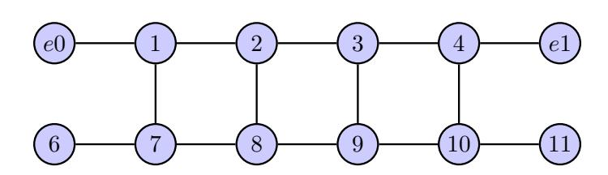
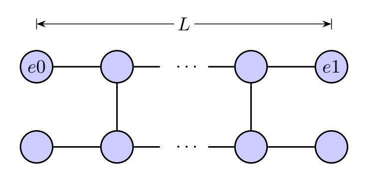

# 量子電路的超距作用

### 1 問題摘要

一個「貝爾態」(Bell state) 是兩個量子位元的量子態,具有兩位元間之最大量子糾纏,即愛因斯坦所稱的「鬼魅般的超距作用」(Spooky action at a distance)。設計一個量子電路,使兩個相距遠的量子位元處於貝爾態。

## 2 題目

考慮一特殊量子處理器(QPU),其量子位元的佈局呈一雙腳梯子狀(見圖 Fig. 1)。處理器上的雙位元量子閘(例如,CNOT 閘)僅能作用於相鄰的兩個量子位元上。圖 Fig. 1 中實線連結可被雙位元量子閘作用的相鄰位元,也就是説,雙位元量子閘可作用於圖中編號為e0及1之兩個量子位元,或1及7兩個位元,但不能作用於圖中編號為1及3兩個位元,或e0及6兩個位元。

Fig. 1

Fig. 2

• 設計一量子電路板,使單腳兩端量子位元e0及e1處於如下任一貝爾熊:

$$\begin{split} |\Phi^{+}\rangle &= \frac{1}{\sqrt{2}} \big( |00\rangle + |11\rangle \big) \\ |\Phi^{-}\rangle &= \frac{1}{\sqrt{2}} \big( |00\rangle - |11\rangle \big) \\ |\Psi^{+}\rangle &= \frac{1}{\sqrt{2}} \big( |01\rangle + |10\rangle \big) \\ |\Psi^{-}\rangle &= \frac{1}{\sqrt{2}} \big( |01\rangle - |10\rangle \big) \end{split}$$

- 可使用之量子閘僅限於單位元閘及相鄰雙位元閘。
- 此電路板應具備橫向(沿梯腳方向)可擴充性,適用於任何長度(L)的雙腳梯子型位元佈局(見圖 Fig. 2)。

# 3 競賽規則

- 本競賽參加者資格:全國在學大專生、碩士生、或博士生。
- 可1至最多4人組隊參加,每人限參加1組隊伍。
- 競賽過程分兩階段:初賽及決賽。
- 初賽作品以線上方式繳交,作品須包含
  - \* 量子電路板圖示説明。
  - \* 説明兩個目標量子位元處於哪一貝爾態 $|\Phi^+\rangle$ , $|\Phi^-\rangle$ , $|\Psi^+\rangle$ ,或 $|\Psi^-\rangle$ 。
  - \* 解答驗證方法,或/及推導。
  - \* 執行量子電路板之程式碼,加註程式所需套件及執行説明。
  - \* 簡述研究、解題、學習過程;若有參考資料、指導教師貢獻、使用 AI工具、 使用他人作品等,應明確列出,並説明使用範圍。

#### • 決審

通過初賽者,將被邀請於2026/5/16 (星期六) 参加作品發表決賽。當天評審委員將 擇優選出獲獎隊伍及作品。

### 参賽獎勵

本活動將依據參賽作品的正確性、創新性、驗證方法/推導之嚴謹度、程式碼品質、作品書面説明及口頭發表之清晰度,擇優選出以下獎項:

\* 特優獎:頒發2萬元獎勵金。

\* 創新獎:頒發1萬元獎勵金。

\* 佳作:頒發5千元獎勵金。

#### 另外,將提供

\* **手刀獎**:頒發 **500** 元獎勵金給最快完成報名且於期限內上傳作品者的前 6 組隊伍。評比時間以報名完成時間為準,非作品上傳時間,惟後者須落於期限内。

### • 活動時間及地點

- \* 2026/05/06, 23:59 前,完成報名及作品上傳。 報名及繳交作品網址:https://forms.gle/bDQBQZ8aSJuHbzZE7 (參賽者可於期限內,先報名,再上傳作品,且作品可更新上傳)。
- \* 2026/05/11:公佈入選隊伍,通知参加決賽。
- \* **2026**/**05**/**16**:決賽,由入選隊伍口頭發表、講解作品。 地點:國立政治大學(國關中心園區)應用物理研究所
- 主辦單位將於「政治大學應用物理研究所」網頁公告入選隊伍、及獲獎隊伍。

# 4 其他注意事項

- 競賽獎項由評審於 5/16 作品發表決賽擇優選出,必要時可從缺、調整或增加。
- 獎金含稅並依所得稅法規定辦理扣繳。
- 主辦單位保有最終修改變更活動解釋及取消本活動之權利。
- 決賽活動將進行錄影、拍攝,其影像供主辦單位、協辦單位日後教育推廣及成果 紀錄使用。

### 主辦單位:

國立政治大學應用物理研究所 國立政治大學電子物理學士學位學程

### 贊助及協辦:

國科會「量子虛擬機」計畫國科會「物理系所研究特色發展」計畫

報名網址